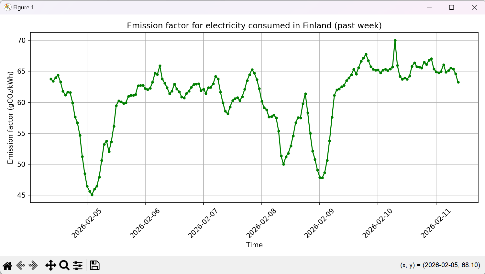

**About the application**

The application visualises the emission factor for electricity consumed in Finland. This means estimate of carbon dioxide of produced electricity, which is consumed in Finland. The emissions are estimated by taking Finland's electricity production, electricity import as well as electricity export into account. The data is retrieved from Fingrid open data API. More information about the dataset: https://data.fingrid.fi/en/datasets/265

Emissions are visualised with user-defined time range: past hour, day, week or month. Because the dataset includes data points every 3 minutes, only the past hour time range shows each data point. Other time range options averages the data points within certain interwals. The interwals are 15 min for day, 1 hour for week and 6 hours for month.

**How to configure**

Instructions to obtain the API-key: https://data.fingrid.fi/en/instructions
Personal API-key is then pasted on main.py configuration section to constant API_KEY = "your api-key here"

**How to run the application**

Requirements for Python libraries are listed on requirements.txt. The application is run by running main.py. The application prints the time range options on command line, and asks to select a time range. User selects time range by typing the time range, for example "day". The application then opens a window for matplotlib plot, which shows the times on x-axis and emissions on y-axis. Visualisation shows data points in defined time intervals as well as connection line. Application handles error situations with API-keys and network.

**Example run and output**

```
PS C:\users\xx> python main.py
Select time range:
 - hour
 - day
 - week
 - month
Enter choice: week
```
 (output image)
